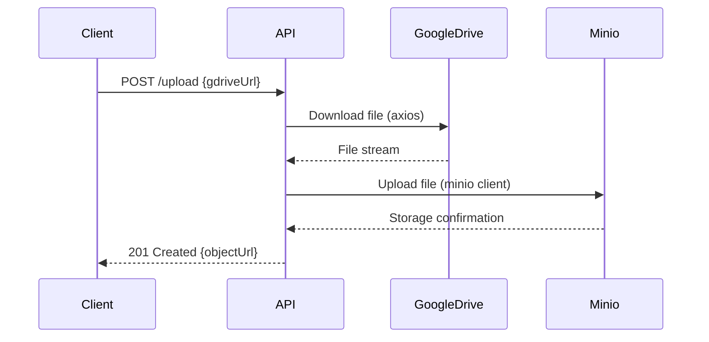

# Google Drive to Minio API Implementation Roadmap

## Project Structure

```
cdn-project/
├── src/
│   ├── controllers/        # Route controllers
│   │   └── upload.controller.ts
│   ├── services/           # Business logic
│   │   ├── google.service.ts
│   │   └── minio.service.ts
│   ├── utils/              # Helper functions
│   │   └── validation.ts
│   ├── app.ts              # Express app setup
│   └── index.ts            # Entry point
├── test/                   # Test cases
├── .env                    # Environment variables
├── bun.lockb               # Bun lockfile
├── package.json            # Project metadata
├── tsconfig.json           # TypeScript config
└── README.md               # Project documentation
```

## Dependencies

```bash
bun add express minio axios dotenv
bun add -D typescript @types/express @types/node ts-node
```

## API Flow



## Implementation Details

### 1. Express Setup (`src/app.ts`)

```typescript
import express from "express";
import uploadRouter from "./controllers/upload.controller";

const app = express();
app.use(express.json());
app.use("/upload", uploadRouter);

export default app;
```

### 2. Google Drive Service (`src/services/google.service.ts`)

```typescript
import axios from "axios";

export const downloadFile = async (url: string) => {
  const fileId = extractFileId(url); // Implement URL parsing
  const response = await axios.get(
    `https://drive.google.com/uc?export=download&id=${fileId}`,
    {
      responseType: "stream",
    }
  );
  return response.data;
};
```

### 3. Minio Service (`src/services/minio.service.ts`)

```typescript
import { Client } from "minio";

const minioClient = new Client({
  endPoint: process.env.MINIO_ENDPOINT,
  port: parseInt(process.env.MINIO_PORT),
  useSSL: process.env.MINIO_SSL === "true",
  accessKey: process.env.MINIO_ACCESS_KEY,
  secretKey: process.env.MINIO_SECRET_KEY,
});

export const uploadToMinio = async (stream: any, filename: string) => {
  await minioClient.putObject(process.env.MINIO_BUCKET, filename, stream);
  return `${process.env.MINIO_ENDPOINT}/${process.env.MINIO_BUCKET}/${filename}`;
};
```

### 4. Upload Controller (`src/controllers/upload.controller.ts`)

```typescript
import { Request, Response } from "express";
import { downloadFile } from "../services/google.service";
import { uploadToMinio } from "../services/minio.service";

export const uploadFromDrive = async (req: Request, res: Response) => {
  try {
    const { gdriveUrl } = req.body;
    const fileStream = await downloadFile(gdriveUrl);
    const objectUrl = await uploadToMinio(fileStream, Date.now().toString());
    res.status(201).json({ objectUrl });
  } catch (error) {
    res.status(500).json({ error: "File processing failed" });
  }
};
```

## Required Environment Variables (`.env`)

```ini
MINIO_ENDPOINT=your-minio-endpoint
MINIO_PORT=9000
MINIO_SSL=false
MINIO_ACCESS_KEY=your-access-key
MINIO_SECRET_KEY=your-secret-key
MINIO_BUCKET=uploads
```

## Best Practices

1. **Validation**: Google Drive URL validation using regex
2. **Security**: File type and size restrictions
3. **Resilience**: Proper error handling and retry mechanisms
4. **Observability**: Request logging and monitoring
5. **Testing**: Unit/integration tests for all services
6. **Scalability**: Rate limiting for API endpoints

## Next Steps

1. Provide Minio credentials and endpoint details
2. Initialize project with `bun init`
3. Implement the solution in Code mode
